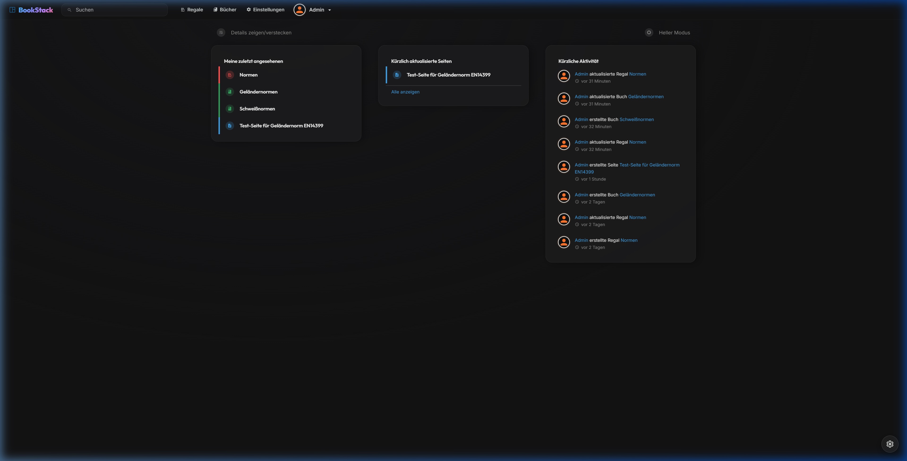
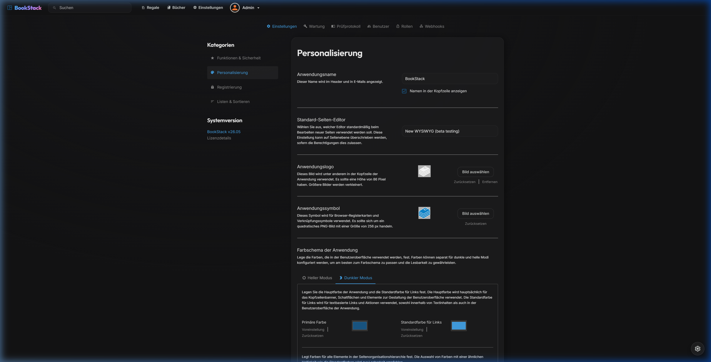

# SilverWiki — Modern Google Gemini "Neural Expressive" Overlay for BookStack

SilverWiki is a state-of-the-art, self-hosted company wiki. It is built on the stable open-source software **BookStack**, but gives it a completely redesigned, premium design overlay based on the **Google Gemini "Neural Expressive"** design language (high contrast, fluid cyan-indigo-purple gradients, minimalist typography with Outfit/Inter, glassmorphism, adjustable layout density).

The integration is built to be **update-safe**: the original BookStack remains untouched as a Git repository, while our theme is stored separately and mounted in via a Docker volume.

### 🌟 Added Value: Custom Features on top of BookStack
* **Local AI Knowledge Assistant (RAG):** Built-in chat assistant powered by Ollama that automatically indexes BookStack pages and answers questions strictly based on the wiki context.
* **Gemini "Neural Expressive" Redesign:** Seamless integration of Outfit (headings) and Inter (body) fonts, custom color palettes, and deep dark/light mode optimization.
* **Interactive Tweaks Panel:** A custom settings panel allowing real-time layout density selection (Normal vs. Compact), background customization (Fluid Gradient vs. Flat Neutral), and card layout modes.
* **Smart Data Tables:** Every standard table on wiki pages automatically becomes an interactive, sortable, and searchable datatable. It dynamically hides controls for small lists to keep clean layouts.
* **Corporate templates:** Built-in template manager supporting SOPs (Standard Operating Procedures), norms summaries, specifications sheets, and onboarding checklists.
* **draw.io Custom Theme:** Custom color palette and Outfit/Inter fonts automatically integrated directly into the embedded draw.io editor.
* **Shelves as Sidebar Categories:** Custom navigation that elevates BookStack shelves to top-level sidebar items.

---

## 📸 Screenshots & Preview

Here you can see the modern Google Gemini "Neural Expressive" design in action:

### Main Dashboard (Wiki Home)


### Customization & Display Settings


---

## 1. 🚀 Quick Start & Installation

This project includes fully automated setup scripts that handle all necessary configuration and startup steps in a single run — checking requirements, starting containers, and opening the app directly in your browser.

### A. Prerequisites (Download Links)
Make sure the following software is installed and running on your system before starting:
1. **Docker Desktop:** [Download Docker Desktop](https://www.docker.com/products/docker-desktop/) (Required to run the container environment).
2. **Git:** [Download Git](https://git-scm.com/downloads) (Required for cloning and updating repositories).

> [!IMPORTANT]
> **Start the Docker Daemon:** Make sure Docker Desktop is running before executing the setup script.
>
> **Auto-Start configured:** The containers are configured with `restart: unless-stopped` in `docker-compose.yml`. They will start automatically with the Docker service or on system restarts, as long as they haven't been manually stopped.

---

### B. One-Click Installation

Simply run the appropriate script for your operating system from the project root directory:

#### 💻 On Windows (PowerShell):
Open a PowerShell console in the project directory and run:
```powershell
powershell -ExecutionPolicy Bypass -File .\setup.ps1
```

#### 🐧 On Linux / macOS / WSL (Bash):
Open a terminal in the project directory and run:
```bash
chmod +x setup.sh
./setup.sh
```

**What the script does automatically for you:**
* Checks prerequisites (Git, Docker, and running daemon).
* Clones the original BookStack into the `/bookstack` subdirectory (on the stable `release` branch).
* Sets Windows-compatible line endings (LF) to prevent startup issues in Docker.
* Creates the `.env` configuration file with pre-configured database and email settings.
* Starts the Docker containers (with configured auto-start policy).
* Verifies accessibility and opens SilverWiki **automatically in your default browser**.

---

## 2. 🔐 Admin First Login

After the script has completed successfully, the application will open in your browser. You can log in with the following default credentials:

* **URL:** [http://localhost:8080/login](http://localhost:8080/login)
* **Email:** `admin@admin.com`
* **Password:** `password`

> [!WARNING]
> **Security notice for production use:**
> Change these default credentials immediately after your first login, in the admin area under **User Profile** -> **Edit Profile**. Also generate a secure application key via `php artisan key:generate` for production use.

---

## 3. 🛠️ Manual Installation (Step by Step)

If you prefer to set things up manually, follow these steps in order:

#### Step A: Clone the repository
```bash
git clone https://github.com/HavocXY/SilverWiki.git
cd SilverWiki
```

#### Step B: Clone BookStack & select branch
Clone BookStack into the `bookstack/` subdirectory and check out the stable `release` branch:
```bash
git clone https://github.com/BookStackApp/BookStack.git bookstack
cd bookstack
git checkout release
cd ..
```

#### Step C: Set Windows Git attributes (Important on Windows)
Create the file `bookstack/.git/info/attributes` and add the following line to prevent shell script startup errors in Docker:
```text
*.sh text eol=lf
```

#### Step D: Create configuration (`.env`)
Create a `.env` file in the `bookstack/` folder with the following settings:
```env
APP_KEY=base64:c2lsdmVyd2lraWRldmtleTEyMzQ1Njc4OTAxMjM0NTY=
DB_CONNECTION=mysql
DB_HOST=db
DB_PORT=3306
DB_DATABASE=bookstack-dev
DB_USERNAME=bookstack-test
DB_PASSWORD=bookstack-test
APP_THEME=silverwiki
APP_URL=http://localhost:8080
MAIL_DRIVER=smtp
MAIL_HOST=mailhog
MAIL_PORT=1025
MAIL_FROM_NAME="SilverWiki Mailer"
MAIL_FROM=silverwiki@local.dev
APP_LANG=de
```

#### Step E: Start containers
```bash
docker compose up -d
```
The application is now available at [http://localhost:8080](http://localhost:8080) and the email monitor (Mailhog) at [http://localhost:8025](http://localhost:8025).

---

## 4. ⚙️ Operations & Docker Commands

* **Stop containers:**
  ```bash
  docker compose down
  ```
* **Start containers:**
  ```bash
  docker compose up -d
  ```
* **Rebuild containers:**
  ```bash
  docker compose up -d --build
  ```
* **View live logs:**
  ```bash
  docker compose logs -f app
  ```
* **Backup database:**
  ```bash
  docker compose exec db mysqldump -u bookstack-test -pbookstack-test bookstack-dev > backup.sql
  ```
* **Restore database:**
  ```bash
  docker compose exec -T db mysql -u bookstack-test -pbookstack-test bookstack-dev < backup.sql
  ```

---

## 🐳 Conflict Avoidance & Container Isolation

To ensure SilverWiki runs smoothly and does not collide with other Docker containers or system paths, the following mechanisms are in place:

### 1. Resolving Port Conflicts (Flexible Ports)
If port `8080` (web application) or `8025` (Mailhog) is already in use by another service on your machine, Docker will block the start.
* **The solution:** Create a file named `.env` in the **project root directory** (`SilverWiki/`, not in the `bookstack/` subdirectory) and define alternative ports:
  ```env
  DEV_PORT=9090
  DEV_MAIL_PORT=9025
  ```
  Docker Compose reads these values automatically. The application will then start at `http://localhost:9090` and BookStack will automatically adapt its internal redirects to the new URL.

### 2. Network Isolation (No Database Conflicts)
* **How it works:** Docker Compose creates an isolated virtual network on startup (e.g. `silverwiki_default`).
* All containers within this project (`app`, `db`, `mailhog`) communicate over this internal network and address each other by their service names (e.g. `db` as hostname).
* **Advantage:** Even if another MySQL server or Docker project is already running on your host machine, the databases will never interfere with each other. The SilverWiki app container will always connect exclusively to its own SilverWiki database.

### 3. Absolute Portability (Relative Paths)
* **How it works:** All volume mounts in `docker-compose.yml` use relative paths (e.g. `./theme` and `./bookstack`).
* **Advantage:** The physical path on your hard drive doesn't matter at all. You can freely move, rename, or copy the `SilverWiki/` folder — Docker Compose always resolves paths relative to the location of `docker-compose.yml`, so the links always point to the correct folders.

---

## 5. 📋 Features

* **Local AI Knowledge Assistant (RAG):** Built-in chat assistant powered by Ollama that automatically indexes BookStack pages and answers questions strictly based on the wiki context.
* **Gemini "Neural Expressive" UI/UX:** Minimalist, high-fidelity interface using the **Outfit** font (headings) and **Inter** (body), fluid brand gradients, and optimal contrast for excellent readability throughout the UI.
* **Non-destructive Architecture:** BookStack can be updated at any time via `git pull` without overwriting our custom theme or causing merge conflicts.
* **Built-in Tweaks Panel:** Users can configure layout density (Normal vs. Compact), view type (Cards vs. List), and background style (Gradient + Grid vs. Flat) directly in the UI. Settings are persisted in LocalStorage.
* **Shelves as Categories:** BookStack's shelves are displayed seamlessly as main categories in the left sidebar.
* **Interactive Data Tables:** Standard tables on wiki pages (with headers) are automatically upgraded with search filtering, client-side sorting, and pagination using a custom Gemini dark/light style.
* **Corporate Templates Library:** Includes standard operating procedures (SOPs), norms, data sheets, and onboarding templates. Seeded via a single Artisan console command.
* **draw.io Custom Theme:** Integrates custom Gemini color palettes and Outfit/Inter fonts automatically inside the builtin draw.io editor.

---

## 📂 Directory Structure

- `/bookstack` — The original BookStack subdirectory (Git clone).
- `/theme` — Our custom theme (Blade templates, CSS, JS, HTML templates, and functions.php).
- `/tests` — E2E and integration tests written in Playwright.
- `/docker-compose.yml` — The central Docker configuration in the root directory.

---

## 🔄 Updating BookStack (Step-by-Step Guide)

Since our custom theme is completely isolated from the `bookstack/` directory, you can safely update BookStack to the latest version at any time without causing merge conflicts.

### Quick Commands (Copy & Paste)
```bash
# 1. Create a database backup
docker compose exec db mysqldump -u bookstack-test -pbookstack-test bookstack-dev > backup.sql

# 2. Enter the BookStack folder, pull the latest code, and return
cd bookstack
git fetch && git pull
cd ..

# 3. Restart containers (runs composer install & DB migrations)
docker compose down
docker compose up -d

# 4. Check logs
docker compose logs -f app
```

---

## 💻 Developer Information
For detailed information on architecture, design decisions, and guidelines for AI agents, see [gemini.md](gemini.md).

---

# SilverWiki — Modernes Google Gemini „Neural Expressive“ Overlay für BookStack

SilverWiki ist ein hochmodernes, firmeninternes Wiki für den Eigengebrauch. Es basiert auf der stabilen Open-Source-Software **BookStack**, verpasst dieser jedoch ein komplett neues, premium-gestaltetes Design-Overlay basierend auf der **Google Gemini „Neural Expressive“**-Designsprache (hoher Kontrast, flüssige Cyan-Indigo-Lila Verläufe, minimalistische Typografie mit Outfit/Inter, Glassmorphismus, einstellbare Layoutdichte).

Die Integration ist **update-sicher** aufgebaut: Das originale BookStack bleibt als Git-Repository unberührt, während unser Theme getrennt gelagert und per Docker-Volume hineingemountet wird.

### 🌟 Mehrwert: Custom-Features zusätzlich zu BookStack
* **Lokaler KI-Wissens-Assistent (RAG):** Integrierter Chat-Assistent ("Bookworm") betrieben mit Ollama, der BookStack-Seiten automatisch indiziert und Fragen streng auf Basis des Wiki-Kontexts beantwortet.
* **Gemini „Neural Expressive“ Redesign:** Outfit-Schriftart für markante Überschriften, Inter-Schriftart für Fließtexte und flüssige Cyan-Indigo-Lila-Verläufe in Dark- und Light-Modes.
* **Interaktives Tweaks-Panel:** Live-Anpassung der Layout-Dichte (Normal vs. Kompakt), des Hintergrunds (Farbverlauf + Gitter vs. Neutral-Flach) und der Buch-Darstellung, direkt im UI steuerbar und im LocalStorage gesichert.
* **Smarte Datentabellen:** Automatische Verwandlung von Standardtabellen in durchsuchbare, sortierbare und paginierte Datentabellen mit dynamischer Skalierung für kleine und große Tabellen.
* **Seitenvorlagen-Bibliothek:** Vorgefertigte Layouts für Arbeitsanweisungen (SOPs), Normen-Zusammenfassungen, Materialdatenblätter und Onboarding-Steckbriefe.
* **draw.io-Branding:** Unternehmenseigene Gemini-Farbpalette und Schriftarten (Outfit, Inter) direkt in den integrierten draw.io-Diagrammeditor eingespeist.
* **Regale als Seitenkategorien:** Integration der Buchregale als Hauptkategorien in der linken Sidebar für eine intuitivere Navigation.

---

## 📸 Screenshots & Vorschau

Hier siehst du das moderne, Google Gemini "Neural Expressive"-Design in Aktion:

### Haupt-Dashboard (Wiki-Home)


### Anpassungs- und Darstellungs-Einstellungen


---

## 1. 🚀 Schnellstart & Installation

Dieses Projekt enthält vollautomatische Setup-Skripte, die alle notwendigen Konfigurations- und Startschritte in einem einzigen Durchlauf für dich erledigen, Fehler prüfen, die Container starten und die Anwendung direkt im Browser öffnen.

### A. Voraussetzungen (Download-Links)
Stelle vor dem Start sicher, dass folgende Software auf deinem System installiert und aktiv ist:
1. **Docker Desktop:** [Docker Desktop herunterladen](https://www.docker.com/products/docker-desktop/) (Erforderlich, um die Container-Umgebung auszuführen).
2. **Git:** [Git herunterladen](https://git-scm.com/downloads) (Erforderlich für das Klonen und Updaten der Repositories).

> [!IMPORTANT]
> **Docker-Daemon starten:** Stelle sicher, dass Docker Desktop gestartet ist, bevor du das Installationsskript ausführst.
>
> **Auto-Start konfiguriert:** Die Container sind im `docker-compose.yml` mit `restart: unless-stopped` konfiguriert. Sie starten automatisch mit dem Docker-Dienst oder bei Systemneustarts, sofern sie nicht manuell gestoppt wurden.

---

### B. Installation mit einem Klick (Ein-Klick-Setup)

Führe einfach das entsprechende Skript für dein Betriebssystem im Projekt-Wurzelverzeichnis aus:

#### 💻 Unter Windows (PowerShell):
Öffne eine PowerShell-Konsole im Projektverzeichnis und führe aus:
```powershell
powershell -ExecutionPolicy Bypass -File .\setup.ps1
```

#### 🐧 Unter Linux / macOS / WSL (Bash):
Öffne ein Terminal im Projektverzeichnis und führe aus:
```bash
chmod +x setup.sh
./setup.sh
```

**Was das Skript vollautomatisch für dich tut:**
* Prüft die Voraussetzungen (Git, Docker und laufender Daemon).
* Kloniert das originale BookStack in das Unterverzeichnis `/bookstack` (auf dem stabilen `release`-Branch).
* Richtet die Windows-kompatiblen Zeilenenden (LF) ein, um Startprobleme in Docker zu verhindern.
* Erstellt die Konfigurationsdatei `.env` mit vorkonfigurierten Datenbank- und E-Mail-Einstellungen.
* Startet die Docker-Container (mit konfigurierter Auto-Start-Policy).
* Überprüft die Erreichbarkeit und öffnet SilverWiki **automatisch in deinem Standardbrowser**.

---

## 2. 🔐 Admin-Erstanmeldung

Nach erfolgreichem Durchlauf des Skripts öffnet sich die Anwendung in deinem Browser. Du kannst dich mit folgenden Standarddaten anmelden:

* **URL:** [http://localhost:8080/login](http://localhost:8080/login)
* **E-Mail-Adresse:** `admin@admin.com`
* **Passwort:** `password`

> [!WARNING]
> **Sicherheitshinweis für den Betrieb:**
> Ändere diese Standard-Zugangsdaten unverzüglich nach der ersten Anmeldung im Administrationsbereich unter **Nutzerprofil** -> **Profil bearbeiten**. Generiere außerdem für den Produktivbetrieb einen sicheren Application-Key via `php artisan key:generate`.

---

## 3. 🛠️ Manuelle Installation (Schritt-für-Schritt)

Falls du die Einrichtung lieber manuell vornehmen möchtest, führe folgende Schritte nacheinander aus:

#### Schritt A: Repository klonen
```bash
git clone https://github.com/HavocXY/SilverWiki.git
cd SilverWiki
```

#### Schritt B: BookStack klonen & Branch wählen
Klone BookStack in das Unterverzeichnis `bookstack/` und checke den stabilen `release`-Branch aus:
```bash
git clone https://github.com/BookStackApp/BookStack.git bookstack
cd bookstack
git checkout release
cd ..
```

#### Schritt C: Windows Git-Attribute setzen (Wichtig auf Windows)
Erstelle die Datei `bookstack/.git/info/attributes` und füge folgende Zeile hinzu, um Shell-Skript-Startfehler in Docker zu verhindern:
```text
*.sh text eol=lf
```

#### Schritt D: Konfiguration (`.env`) erstellen
Erstelle eine `.env`-Datei im Ordner `bookstack/` mit folgenden Einstellungen:
```env
APP_KEY=base64:c2lsdmVyd2lraWRldmtleTEyMzQ1Njc4OTAxMjM0NTY=
DB_CONNECTION=mysql
DB_HOST=db
DB_PORT=3306
DB_DATABASE=bookstack-dev
DB_USERNAME=bookstack-test
DB_PASSWORD=bookstack-test
APP_THEME=silverwiki
APP_URL=http://localhost:8080
MAIL_DRIVER=smtp
MAIL_HOST=mailhog
MAIL_PORT=1025
MAIL_FROM_NAME="SilverWiki Mailer"
MAIL_FROM=silverwiki@local.dev
APP_LANG=de
```

#### Schritt E: Container starten
```bash
docker compose up -d
```
Die Anwendung ist nun unter [http://localhost:8080](http://localhost:8080) und die E-Mail-Überwachung (Mailhog) unter [http://localhost:8025](http://localhost:8025) erreichbar.

---

## 4. ⚙️ Betrieb & Docker-Befehle

* **Container stoppen:**
  ```bash
  docker compose down
  ```
* **Container starten:**
  ```bash
  docker compose up -d
  ```
* **Container neu bauen:**
  ```bash
  docker compose up -d --build
  ```
* **Live-Logs einsehen:**
  ```bash
  docker compose logs -f app
  ```
* **Datenbank sichern (Backup):**
  ```bash
  docker compose exec db mysqldump -u bookstack-test -pbookstack-test bookstack-dev > backup.sql
  ```
* **Datenbank wiederherstellen:**
  ```bash
  docker compose exec -T db mysql -u bookstack-test -pbookstack-test bookstack-dev < backup.sql
  ```

---

## 🐳 Konfliktvermeidung & Container-Isolierung

Um sicherzustellen, dass SilverWiki reibungslos läuft und nicht mit anderen Docker-Containern oder Systempfaden kollidiert, greifen folgende Mechanismen:

### 1. Port-Konflikte lösen (Flexible Ports)
Falls Port `8080` (Webanwendung) oder `8025` (Mailhog) bereits von einem anderen Dienst auf deinem Rechner belegt sind, blockiert Docker den Start.
* **Die Lösung:** Erstelle im **Projekt-Wurzelverzeichnis** (`SilverWiki/`, nicht im Unterordner `bookstack/`) eine Datei namens `.env` und definiere freie Wunsch-Ports:
  ```env
  DEV_PORT=9090
  DEV_MAIL_PORT=9025
  ```
  Docker-Compose liest diese Werte automatisch aus. Die Anwendung startet dann unter `http://localhost:9090` und BookStack passt seine internen Redirects vollautomatisch an diese neue URL an.

### 2. Netzwerk-Isolierung (Keine Datenbank-Konflikte)
* **Die Funktionsweise:** Docker Compose erstellt beim Start ein isoliertes virtuelles Netzwerk (z. B. `silverwiki_default`). 
* Alle Container innerhalb dieses Projekts (`app`, `db`, `mailhog`) kommunizieren verschlüsselt über dieses interne Netzwerk und sprechen sich über ihre Service-Namen (z. B. `db` als Hostname) an.
* **Vorteil:** Selbst wenn auf deinem Host-Rechner bereits ein anderer MySQL-Server oder ein anderes Docker-Projekt läuft, kommen sich die Datenbanken nicht in die Quere. Der SilverWiki-App-Container greift garantiert immer auf die zugehörige SilverWiki-Datenbank zu.

### 3. Absolute Portabilität (Relative Pfade)
* **Die Funktionsweise:** In der Datei `docker-compose.yml` sind alle Volume-Mounts mit relativen Pfaden (z. B. `./theme` und `./bookstack`) definiert.
* **Vorteil:** Das bedeutet, dass der physische Pfad auf deiner Festplatte vollkommen egal ist. Du kannst den Ordner `SilverWiki/` beliebig verschieben, umbenennen oder kopieren – Docker Compose löst die Pfade immer relativ zum Standort der `docker-compose.yml` auf, sodass die Verknüpfungen stets auf die korrekten Ordner verweisen.

---

## 5. 📋 Features

* **Lokaler KI-Wissens-Assistent (RAG):** Integrierter Chat-Assistent ("Bookworm") betrieben mit Ollama, der BookStack-Seiten automatisch indiziert und Fragen streng auf Basis des Wiki-Kontexts beantwortet.
* **Gemini „Neural Expressive“ UI/UX:** Minimalistisches, hochauflösendes Interface mit der Schriftart **Outfit** (Überschriften) und **Inter** (Body), flüssigen Brand-Gradients und optimalem Kontrast für beste Lesbarkeit in den Seitenbereichen.
* **Zerstörungsfreie Architektur:** BookStack kann jederzeit via `git pull` aktualisiert werden, ohne dass unser Custom-Theme überschrieben wird oder Merge-Konflikte auftreten.
* **Integriertes Tweaks-Panel:** Nutzer können Layout-Dichte (Normal vs. Kompakt), Layout-Typ (Karten vs. Liste) und Hintergrund-Stile (Gradient + Grid vs. Flat) direkt im UI einstellen. Die Einstellungen werden im LocalStorage persistiert.
* **Regale als Kategorien:** BookStacks Regale (Shelves) werden nahtlos als Hauptkategorien in der linken Sidebar dargestellt.
* **Interaktive & sortierbare Tabellen:** Tabellen auf Wiki-Seiten (sofern sie Kopfzeilen besitzen) erhalten vollautomatisch clientseitige Sortierung, Suche und Pagination basierend auf `simple-datatables`, wunderschön gestaltet im SilverWiki CSS-Design.
* **Seitenvorlagen-Bibliothek:** Vordefinierte Vorlagen für Arbeitsanweisungen (SOPs), Normen-Zusammenfassungen, Materialdatenblätter und Onboarding-Steckbriefe in einem eigenen Buch. Importiert und aktualisiert über ein custom Artisan Command.
* **draw.io Custom Theme Integration:** Integration von unternehmenseigenen Gemini-Farbpaletten und Standard-Schriftarten (Outfit, Inter) direkt im integrierten draw.io-Editor.

---

## 📂 Verzeichnisstruktur

- `/bookstack` — Das originale BookStack-Subverzeichnis (Git-Klon).
- `/theme` — Unser Custom Theme (Blade-Templates, CSS, JS, Seitenvorlagen und functions.php).
- `/tests` — E2E- und Integrationstests (Playwright).
- `/docker-compose.yml` — Die zentrale Docker-Konfiguration im Wurzelverzeichnis.

---

## 🔄 BookStack aktualisieren (Schritt-für-Schritt-Anleitung)

Da unser Custom Theme vollständig vom `bookstack/`-Verzeichnis isoliert ist, kannst du BookStack jederzeit gefahrlos auf den neuesten Stand bringen, ohne dass es zu Merge-Konflikten kommt.

### Schnellbefehle (Copy & Paste)
```bash
# 1. Datenbank-Backup erstellen
docker compose exec db mysqldump -u bookstack-test -pbookstack-test bookstack-dev > backup.sql

# 2. In den BookStack-Ordner wechseln, neuesten Code ziehen und zurückkehren
cd bookstack
git fetch && git pull
cd ..

# 3. Container neu starten (führt composer install & DB-Migrationen aus)
docker compose down
docker compose up -d

# 4. Logs kontrollieren
docker compose logs -f app
```

---

## 💻 Entwickler-Informationen
Für detaillierte Informationen zur Architektur, den Design-Entscheidungen und Richtlinien für KI-Agenten, siehe [gemini.md](file:///d:/Antigravity/SilverWiki/gemini.md).
